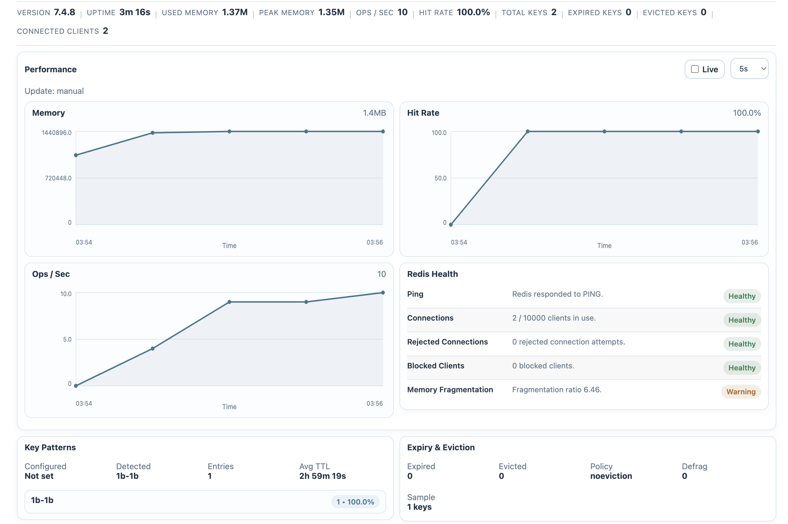
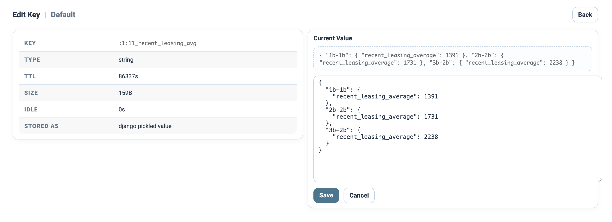

# redis-metrics

`redis-metrics` adds a Redis monitoring dashboard directly inside Django admin.

---



 ---


---

## Features

- Multi-Redis connection support
- Redis health checks
- Live-updating performance charts
- Key explorer with search, paging, delete, and edit support
- Prefix, TTL, and key size analysis
- Slow query visibility via Redis `SLOWLOG`
- Expiry and eviction monitoring
- Celery-aware queue and broker summaries

## Installation

```bash
pip install redis-metrics
```

## Django Setup

Add the app:

```python
INSTALLED_APPS = [
    # ...
    "redis_metrics",
]
```

Optional multi-connection configuration:

```python
REDIS_METRICS_CONNECTIONS = {
    "cache": {
        "LOCATION": "redis://127.0.0.1:6379/0",
        "ROLE": "cache",
        "LABEL": "Cache",
    },
    "celery": {
        "LOCATION": "redis://127.0.0.1:6379/1",
        "ROLE": "celery",
        "LABEL": "Celery",
    },
}
```

Then open Django admin and visit the Redis Metrics dashboard.

## Packaging

Build locally with:

```bash
python -m build
```
